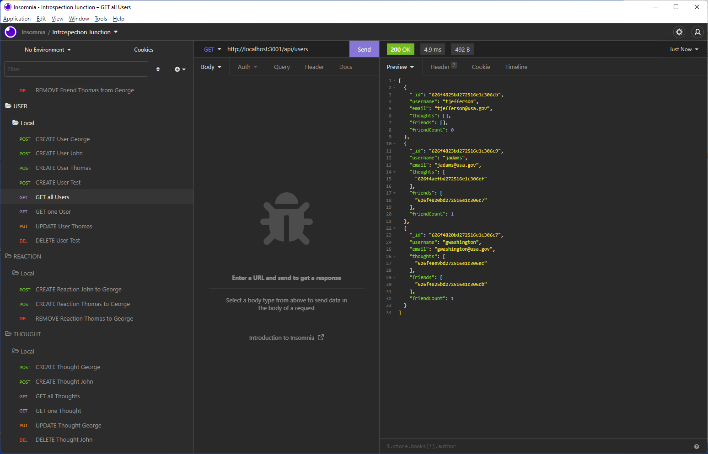

# Introspection Junction

## Description

  - This project is the backend for a social media site where you share your thoughts about anything with other users and they can react to your thoughts.
  - I was very excited to use MongoDB as the database for this project. After using relational databases for many years it was refreshing to us a document database because the relaxed schema makes development easier and faster.
  - I wanted to use MongoDB for the database but I also wanted to have schema rules and Mongoose provided that. I am very excited to be using these newer technologies.
  - This project provides the foundation for a social media site where users can store their thoughts and have other users as friends who can react to thier thoughts.
  - I learned how to use MongoDB for the database and Mongoose for the ODM library.

## Table of Contents

  - [Installation](#installation)
  - [Usage](#usage)
  - [License](#license)
  - [Contributing](#contributing)
  
  - [Questions](#questions)

## Installation

  - git clone https://github.com/patrickaregan/introspection-junction.git
  - From the terminal, run "npm i" in the root directory to install dependencies.
  

## Usage

  - From the terminal, run "npm start" to start the server.
  - Use a tool like Insomnia to test the API routes.
  - Watch the demo videos below to see how to use the APIs.

  
  - [Demo video 1](https://drive.google.com/file/d/1i-Kr7cjBMB0PED9lWvoaV_-K6RV8bv5H/view)
  - [Demo video 2](https://drive.google.com/file/d/1hqG-MVMGHLJEpMyW0wcI1rg0VjBAj_iC/view)

## License

  - MIT

## Contributing

  - My contribution rule is to treat others with respect and if you see any violations please contact me at my email below.  
  

## Questions

- [GitHub Profile](https://github.com/patrickaregan)
- If you have additional questions please email me at patrickaregan@gmail.com

